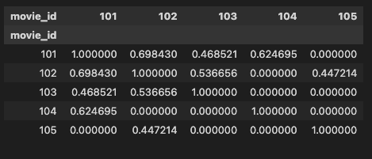
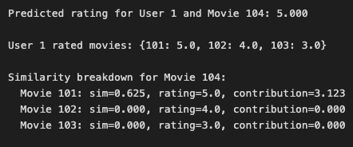
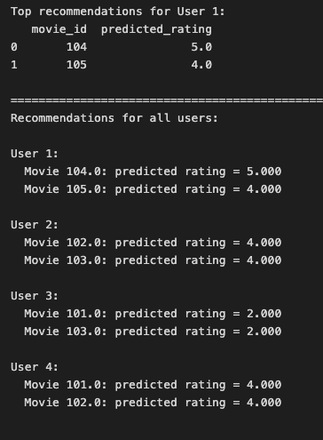

# Item-Based Collaborative Filtering

## Table of Contents
1. [Overview](#overview)
2. [Key Concepts](#key-concepts)
3. [Algorithm Steps](#algorithm-steps)
4. [Implementation](#implementation)
5. [Examples & Calculations](#examples--calculations)
6. [Advantages & Disadvantages](#advantages--disadvantages)

---

## Overview

**Item-Based Collaborative Filtering** is a recommendation technique that recommends items to users based on the similarity between items.

### Core Idea
- Instead of finding similar users (user-based CF), we find similar items
- If a user liked item A, and item B is similar to item A, recommend item B
- Similarity is computed based on user ratings patterns

### When to Use
- Works well when the number of users >> number of items
- Item similarities are relatively stable over time
- Good for e-commerce, movie recommendations, music recommendations

---

## Key Concepts

### 1. User-Item Matrix
A matrix where:
- Rows = Users
- Columns = Items (e.g., movies)
- Values = Ratings given by users to items
- Missing values = Items not rated by users (filled with 0)


### 2. Item-Item Similarity Matrix
A matrix that captures how similar each item is to every other item:
- Rows = Items
- Columns = Items
- Values = Similarity scores (typically 0 to 1)
- Diagonal = 1 (item is identical to itself)

**Similarity Metrics:**
- **Cosine Similarity**: Measures the cosine of angle between item rating vectors
  ```
  similarity(A, B) = (A · B) / (||A|| × ||B||)
  ```
- Other options: Pearson correlation, Euclidean distance




---

## Algorithm Steps

### Step 1: Build User-Item Matrix
Create a matrix from user ratings data with users as rows and items as columns.

### Step 2: Compute Item-Item Similarity
Calculate similarity between all pairs of items based on user ratings patterns.
- Transpose the user-item matrix (items become rows)
- Apply cosine similarity to compute item-item similarities

### Step 3: Predict Rating for User-Item Pair
For predicting user `u`'s rating on candidate item `m`:

1. **Find rated items**: Get all items that user `u` has rated
2. **Find similar items**: Get similarity scores between candidate item `m` and items rated by `u`
3. **Calculate weighted average**:
   ```
   predicted_rating(u, m) = Σ(similarity(m, i) × rating(u, i)) / Σ(similarity(m, i))
   ```
   Where `i` = each item rated by user `u`

### Step 4: Generate Top-N Recommendations
1. Identify all unrated items for the user (candidate items)
2. Predict ratings for each candidate item
3. Sort by predicted rating (descending)
4. Return top N items

---

## Implementation

### Data Structure

```python
# Sample data
user_item_rating = pd.DataFrame({
    "user_id": [1, 1, 1, 2, 2, 3, 3, 4],
    "movie_id": [101, 102, 103, 101, 104, 102, 105, 103],
    "rating": [5, 4, 3, 4, 5, 2, 3, 4],
})
```

### 1. Create User-Item Matrix

```python
user_item_matrix = user_item_rating.pivot_table(
    index="user_id",
    columns="movie_id",
    values="rating"
).fillna(0)
```


### 2. Compute Item-Item Similarity Matrix

```python
from sklearn.metrics.pairwise import cosine_similarity

item_item_similarity = pd.DataFrame(
    cosine_similarity(user_item_matrix.T),  # Transpose: items as rows
    index=user_item_matrix.columns,
    columns=user_item_matrix.columns,
)
```


### 3. Predict Rating Function

```python
def predict_rating(user_id, movie_id, user_item_matrix, item_similarity_matrix):
    """
    Predict rating for a user-movie pair using item-based collaborative filtering.

    Algorithm:
    1. Get all movies rated by user 'u'
    2. For candidate movie 'm', find similarity with all movies rated by 'u'
    3. Calculate weighted average: Σ(similarity(m,i) * rating(u,i)) / Σ(similarity(m,i))
    """
    # Step 1: Get all movies rated by the user
    user_ratings = user_item_matrix.loc[user_id]
    rated_movies = user_ratings[user_ratings > 0]

    # Step 2: Get similarity scores between candidate movie and all movies rated by user
    movie_similarities = item_similarity_matrix.loc[movie_id, rated_movies.index]

    # Step 3: Filter out movies with zero or negative similarity
    movie_similarities = movie_similarities[movie_similarities > 0]

    # If no similar movies found, return 0
    if len(movie_similarities) == 0:
        return 0

    # Step 4: Calculate weighted average
    weighted_sum = sum(movie_similarities * rated_movies[movie_similarities.index])
    similarity_sum = sum(movie_similarities)
    predicted_rating = weighted_sum / similarity_sum

    return predicted_rating
```


### 4. Recommend Movies Function

```python
def recommend_movies(user_id, user_item_matrix, item_similarity_matrix, top_n=5):
    """
    Recommend top N movies for a user.
    """
    all_movies = user_item_matrix.columns
    user_ratings = user_item_matrix.loc[user_id]
    rated_movies = user_ratings[user_ratings > 0].index
    candidate_movies = [m for m in all_movies if m not in rated_movies]

    predictions = []
    for movie_id in candidate_movies:
        predicted_rating = predict_rating(user_id, movie_id, user_item_matrix, item_similarity_matrix)
        predictions.append({'movie_id': movie_id, 'predicted_rating': predicted_rating})

    recommendations = pd.DataFrame(predictions)
    recommendations = recommendations.sort_values('predicted_rating', ascending=False).head(top_n)
    return recommendations.reset_index(drop=True)
```


---

## Examples & Calculations

### Example Dataset

**User-Item Rating Data:**
```
   user_id  movie_id  rating
0        1       101       5
1        1       102       4
2        1       103       3
3        2       101       4
4        2       104       5
5        3       102       2
6        3       105       3
7        4       103       4
```

**User-Item Matrix:**
```
movie_id  101  102  103  104  105
user_id
1         5.0  4.0  3.0  0.0  0.0
2         4.0  0.0  0.0  5.0  0.0
3         0.0  2.0  0.0  0.0  3.0
4         0.0  0.0  4.0  0.0  0.0
```


### Manual Calculation Example

**Goal**: Predict User 1's rating for Movie 104

**Step 1**: User 1's rated movies
- Movie 101: 5 stars
- Movie 102: 4 stars
- Movie 103: 3 stars

**Step 2**: Similarities between Movie 104 and User 1's rated movies
```
similarity(104, 101) = 0.625
similarity(104, 102) = 0.000
similarity(104, 103) = 0.000
```

**Step 3**: Calculate weighted average
```
Numerator (weighted_sum):
  = (0.625 × 5) + (0.000 × 4) + (0.000 × 3)
  = 3.125 + 0 + 0
  = 3.125

Denominator (similarity_sum):
  = 0.625 + 0.000 + 0.000
  = 0.625

Predicted Rating:
  = 3.125 / 0.625
  = 5.0
```

**Interpretation**: Since Movie 104 is only similar to Movie 101 (which User 1 rated 5 stars), the predicted rating is 5.0 stars.



### Understanding the Weighted Average

**Why Weighted?**
- Movies MORE similar to the candidate movie get MORE influence in the prediction
- Movies LESS similar get LESS influence
- Zero similarity = no influence at all

**Formula Breakdown:**
```
predicted_rating(u, m) = Σ(similarity(m, i) × rating(u, i)) / Σ(similarity(m, i))
                         ─────────────────────────────────   ──────────────────
                                weighted contributions         normalization
```

**Example with Multiple Similar Items:**
If User 1 is rating Movie X, and:
- Movie A (rated 5 stars) has similarity 0.8 to Movie X
- Movie B (rated 3 stars) has similarity 0.2 to Movie X

```
Prediction = (0.8 × 5 + 0.2 × 3) / (0.8 + 0.2)
           = (4.0 + 0.6) / 1.0
           = 4.6 stars
```

Movie A has more weight because it's more similar!

---

## Advantages & Disadvantages

### Advantages ✅

1. **Scalability**: Item-item similarities are stable, can be precomputed
2. **Interpretability**: Easy to explain why an item was recommended ("Because you liked X")
3. **Handles sparse data**: Works even when users have rated few items
4. **Quality**: Often produces better recommendations than user-based CF
5. **Stable**: Item relationships change slower than user preferences

### Disadvantages ❌

1. **Cold Start Problem (New Items)**: Cannot recommend items with no ratings
2. **Popularity Bias**: Tends to recommend popular items
3. **Limited Diversity**: Recommends similar items to what user already liked
4. **Scalability (Items)**: Doesn't scale well when number of items is massive
5. **Static Similarities**: Doesn't capture changing item relationships easily
6. **No New Discoveries**: Struggles to recommend items from different categories

### When to Use Item-Based vs User-Based CF

| Aspect | Item-Based CF | User-Based CF |
|--------|---------------|---------------|
| **Best for** | More users than items | More items than users |
| **Stability** | Item similarities stable | User preferences change |
| **Computation** | Precompute item similarities | Compute user similarities on-the-fly |
| **Explanation** | "Users who liked X also liked Y" | "Users similar to you liked Y" |
| **Example** | Amazon products, Netflix movies | Small communities, news articles |

---

## Usage Example

```python
# Predict rating for User 1, Movie 104
predicted = predict_rating(1, 104, user_item_matrix, item_item_similarity)
print(f"Predicted rating: {predicted:.3f}")

# Get top 3 recommendations for User 1
recommendations = recommend_movies(1, user_item_matrix, item_item_similarity, top_n=3)
print(recommendations)
```



---

## Key Takeaways

1. **Item-based CF recommends items based on item similarity**, not user similarity
2. **The weighted average formula** gives more weight to similar items
3. **Cosine similarity** is commonly used to measure item similarity
4. **Precomputation** of item similarities makes it scalable
5. **Works well** when items are more stable than user preferences

---

## Related Topics to Explore

- User-Based Collaborative Filtering
- Matrix Factorization (SVD, ALS)
- Content-Based Filtering
- Hybrid Recommender Systems
- Deep Learning for Recommendations (Neural Collaborative Filtering)

---

**Notebook**: `item_based_CF(simple).ipynb`
**Date**: 2026-01-27
